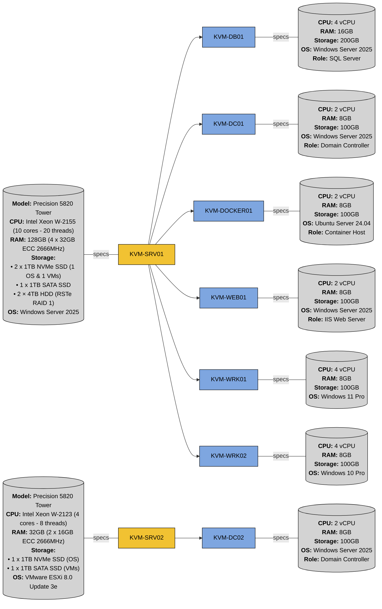

# Homelab Configuration Automation with Ansible

A **_homelab configuration automation_** solution powered by **_Ansible_**, containerized with **_Docker_**. This setup simplifies **_Windows_** and **_standalone ESXi_** systems management by leveraging Ansible's **_idempotent_** and **_declarative configuration_** approach, streamlining **_Infrastructure as Code_** (**_IaC_**) principles for **_Windows_** and **_VMware_** environments.

## Features

-   **_Agentless_** architecture powered by **_Ansible_**, utilizing **_SSH_**.
-   **_Docker-based controller_** for environment consistency across platforms.
-   **_Modular role-based_** configuration and **_tag-based_** execution for targeted provisioning.
-   **_Centralized variable management_** using external YAML files.

## Infrastructure Overview



## Roles

### General

Role                                                                                                                            |Description
:------------------------------------------------------------------------------------------------------------------------------:|:----------------------------------
[`firewall_configuration`](ansible-scripts/homelab-ansible-config/roles/firewall_configuration/tasks/main.yml)                  |Configures **_firewall rules_**
[`linux_hostname_configuration`](ansible-scripts/homelab-ansible-config/roles/linux_hostname_configuration/tasks/main.yml)      |Sets **_hostname_** of Linux hosts
[`linux_ntp_configuration`](ansible-scripts/homelab-ansible-config/roles/linux_ntp_configuration/tasks/main.yml)                |Configures **_NTP settings_** for time synchronization on **_Linux hosts_**
[`linux_updates`](ansible-scripts/homelab-ansible-config/roles/linux_updates/tasks/main.yml)                                    |Performs **_Linux package updates_**
[`local_user_configuration`](ansible-scripts/homelab-ansible-config/roles/local_user_configuration/tasks/main.yml)              |Manages **_local user accounts_** and **_passwords_**
[`region_configuration`](ansible-scripts/homelab-ansible-config/roles/region_configuration/tasks/main.yml)                      |Sets **_regional_** and **_locale settings_**
[`system_configuration`](ansible-scripts/homelab-ansible-config/roles/system_configuration/tasks/main.yml)                      |Applies **_system-wide settings_**
[`system_information`](ansible-scripts/homelab-ansible-config/roles/system_information/tasks/main.yml)                          |Gather **_host information_**
[`windows_hostname_configuration`](ansible-scripts/homelab-ansible-config/roles/windows_hostname_configuration/tasks/main.yml)  |Sets **_hostname_** of Windows hosts
[`windows_ntp_configuration`](ansible-scripts/homelab-ansible-config/roles/windows_ntp_configuration/tasks/main.yml)            |Configures **_NTP settings_** for time synchronization on **_Windows hosts_**
[`windows_updates`](ansible-scripts/homelab-ansible-config/roles/windows_updates/tasks/main.yml)                                |Performs **_Windows updates_**

### Domain

Role                                                                                                                            |Description
:------------------------------------------------------------------------------------------------------------------------------:|:----------------------------------
[`domain_creation`](ansible-scripts/homelab-ansible-config/roles/domain_creation/tasks/main.yml)                                |Creates a new **_AD forest_** along with its **_domains_** and **_OUs_**
[`domain_user_configuration`](ansible-scripts/homelab-ansible-config/roles/domain_user_configuration/tasks/main.yml)            |Manages **domain user accounts_** and **_passwords_**
[`linux_domain_join`](ansible-scripts/homelab-ansible-config/roles/linux_domain_join/tasks/main.yml)                            |**_Joins Linux hosts_** to the **_domain_**
[`windows_domain_join`](ansible-scripts/homelab-ansible-config/roles/windows_domain_join/tasks/main.yml)                        |**_Joins Windows hosts_** to the **_domain_**

### Hypervisors

Role                                                                                                                            |Description
:------------------------------------------------------------------------------------------------------------------------------:|:----------------------------------
[`esxi_vm_deployment`](ansible-scripts/homelab-ansible-config/roles/esxi_vm_deployment/tasks/main.yml)                          |Deploys **_VMs_** on **_ESXi host_**
[`hyper-v_configuration`](ansible-scripts/homelab-ansible-config/roles/hyper-v_configuration/tasks/main.yml)                    |Installs **_Hyper-V_** and configures **_virtual switches_**
[`hyper-v_vm_deployment`](ansible-scripts/homelab-ansible-config/roles/hyper-v_vm_deployment/tasks/main.yml)                    |Deploys **_VMs_** on **_Hyper-V host_**

### Services

Role                                                                                                                            |Description
:------------------------------------------------------------------------------------------------------------------------------:|:----------------------------------
[`docker_configuration`](ansible-scripts/homelab-ansible-config/roles/docker_configuration/tasks/main.yml)                      |Configures **_Docker_** settings
[`filebrowser_deployment`](ansible-scripts/homelab-ansible-config/roles/filebrowser_deployment/tasks/main.yml)                  |Configures **_Filebrowser_** as a **_containerized file manager_** with **_persistent network storage_**
[`grafana_deployment`](ansible-scripts/homelab-ansible-config/roles/grafana_deployment/tasks/main.yml)                          |Configures **_Grafana_** as a **_containerized analytics platform_** for **_dashboards_** and **_data virtualization_**
[`iis_deployment`](ansible-scripts/homelab-ansible-config/roles/iis_deployment/tasks/main.yml)                                  |Installs and configures **_Internet Information Services_** (**_IIS_**)

## Prerequisites

1.  **_[OpenSSH Server](https://github.com/PowerShell/Win32-OpenSSH/releases/latest)_** installed on the targeted hosts. Alternatively, this can be installed via **_PowerShell_**:

    ```powershell
    Add-WindowsCapability -Online -Name OpenSSH.Server~~~~0.0.1.0
    ```

2.  **_SSH Service_** enabled on the targeted hosts:

    ```powershell
    Start-Service sshd
    Set-Service -Name sshd -StartupType 'Automatic'
    ```

3.  **_SSH_** allowed through the **_firewall_**:

    ```powershell
    New-NetFirewallRule -Name 'OpenSSH-Server-In-TCP' -DisplayName 'OpenSSH Server (sshd)' -Enabled True -Direction Inbound -Protocol TCP -Action Allow -LocalPort 22 -Profile Any
    ```

4.  **_SSH connection_** verified **_once_** from the controller to each host:

    ```bash
    ssh administrator@"<IP_ADDRESS>"
    ```

    **_Accept the host key_** on first connection by typing `yes` when prompted.

## Applying Configuration

1.  **Update the inventory and variable files:**

-   Update **_[`inventory.yml`](ansible-scripts/homelab-ansible-config/inventory_template.yml)_** to define the **_target hosts_**.
-   Update **_[`domain_var.yml`](ansible-scripts/homelab-ansible-config/variables/domain_var_template.yml)_** to define the **_domain configuration_**.
-   Update **_[`linux_var.yml`](ansible-scripts/homelab-ansible-config/variables/linux_var_template.yml)_** to define **_Linux-specific variables_**
-   Update **_[`user_var.yml`](ansible-scripts/homelab-ansible-config/variables/user_var_template.yml)_** to define all **_domain users_**.
-   Update **_[`windows_var.yml`](ansible-scripts/homelab-ansible-config/variables/windows_var_template.yml)_** to define **_Windows-specific variables_** (_e.g.,_ usernames, passwords, hostnames, etc.)
-   Update **_[`esxi_vm_var.yml`](ansible-scripts/homelab-ansible-config/variables/esxi_vm_var.yml)_** to define **_ESXI VMs_** and their **_specifications_** to be created and configured.
-   Update **_[`hyper-v_vm_var.yml`](ansible-scripts/homelab-ansible-config/variables/hyper-v_vm_var.yml)_** to define the **_Hyper-V VMs_** and their **_specifications_** to be created and configured.
-   Update **_[`filebrowser_var.yml`](ansible-scripts/homelab-ansible-config/variables/filebrowser_var.yml)_** to define **_Filebrowser settings_**.

2.  **Start the Ansible environment:**

    ```bash
    docker compose up -d
    ```

3.  **Access the running Ansible container:**

    ```bash
    docker exec -it ansible_service /bin/bash
    ```

4.  **Execute the playbook to apply the settings:**

    ```bash
    ansible-playbook site.yml -i inventory.yml
    ```

>   [!TIP]
>   Use `-t` option to selectively run specific plays:
>
>   ```bash
>   ansible-playbook site.yml -i inventory.yml -t system_information
>   ```