# Homelab Configuration Automation with Ansible

A **_homelab configuration automation_** solution powered by **_Ansible_**, containerized with **_Docker_**. This setup simplifies **_Windows_** and **_standalone ESXi_** systems management by leveraging Ansible's **_idempotent_** and **_declarative configuration_** approach, streamlining **_Infrastructure as Code_** (**_IaC_**) principles for **_Windows_** and **_VMware_** environments.

## Features

-   **_Agentless_** architecture powered by **_Ansible_**, utilizing **_SSH_**.
-   **_Docker-based controller_** for environment consistency across platforms.
-   **_Modular role-based_** configuration and **_tag-based_** execution for targeted provisioning.
-   **_Centralized variable management_** using external YAML files.

## Infrastructure Overview

```mermaid
flowchart LR
    %% 1. KVM-SRV01
    %% - Host
    SRV01_SPECS[("`**Model:** Precision 5820 Tower
        **CPU:** Intel Xeon W-2155 (10 cores - 20 threads)
        **RAM:** 256GB (8 x 32GB ECC 2666MHz)
        **Storage:**
        • 2 x 1TB NVMe SSD (1 OS & 1 VMs)
        • 1 x 1TB SATA SSD
        • 2 × 4TB HDD (RSTe RAID 1)
        **OS:** Windows Server 2025`")] -- specs --- SRV01[KVM-SRV01]
    
    %% - VMs
    SRV01 --> DB01[KVM-DB01] -- specs --- DB01_SPECS[("`**CPU:** 4 vCPU
                                                        **RAM:** 16GB
                                                        **Storage:** 200GB
                                                        **OS:** Windows Server 2025
                                                        **Role:** SQL Server`")]
    SRV01 --> DC01[KVM-DC01] -- specs --- DC01_SPECS[("`**CPU:** 2 vCPU
                                                        **RAM:** 8GB
                                                        **Storage:** 100GB
                                                        **OS:** Windows Server 2025
                                                        **Role:** Domain Controller`")]
    SRV01 --> MONITOR[KVM-MONITOR] -- specs --- MONITOR_SPECS[("`**CPU:** 2 vCPU
                                                                **RAM:** 4GB
                                                                **Storage:** 100GB
                                                                **OS:** Ubuntu Server 24.04
                                                                **Role:** Monitoring Server`")]
    SRV01 --> NAS[KVM-NAS] -- specs --- NAS_SPECS[("`**CPU:** 2 vCPU
                                                    **RAM:** 4GB
                                                    **Storage:** 50GB
                                                    **OS:** Ubuntu Server 24.04
                                                    **Role:** NAS`")]        
    SRV01 --> VPN[KVM-VPN] -- specs --- VPN_SPECS[("`**CPU:** 2 vCPU
                                                    **RAM:** 2GB
                                                    **Storage:** 20GB
                                                    **OS:** Ubuntu Server 24.04
                                                    **Role:** VPN`")]
    SRV01 --> WEB01[KVM-WEB01] -- specs --- WEB01_SPECS[("`**CPU:** 2 vCPU
                                                            **RAM:** 8GB
                                                            **Storage:** 100GB
                                                            **OS:** Windows Server 2025
                                                            **Role:** IIS Web Server`")]
    SRV01 --> WRK01[KVM-WRK01] -- specs --- WRK01_SPECS[("`**CPU:** 4 vCPU
                                                            **RAM:** 8GB
                                                            **Storage:** 100GB
                                                            **OS:** Windows 11 Pro`")]
    SRV01 --> WRK03[KVM-WRK03] -- specs --- WRK03_SPECS[("`**CPU:** 4 vCPU
                                                            **RAM:** 8GB
                                                            **Storage:** 100GB
                                                            **OS:** Windows 10 Pro`")]

    

    %% 2. KVM-SRV02
    %% - Host
    SRV02_SPECS[("`**Model:** Precision 5820 Tower
        **CPU:** Intel Xeon W-2123 (4 cores - 8 threads)
        **RAM:** 32GB (2 x 16GB ECC 2666MHz)
        **Storage:**
        • 1 x 512GB NVMe SSD (OS)
        • 1 x 1TB SATA SSD (VMs)
        **OS:** VMware ESXi 8.0 Update 3e`")] -- specs --- SRV02[KVM-SRV02]

    %% - VMs
    SRV02 --> DC02[KVM-DC02] -- specs --- DC02_SPECS[("`**CPU:** 2 vCPU
                                                        **RAM:** 8GB
                                                        **Storage:** 100GB
                                                        **OS:** Windows Server 2025
                                                        **Role:** Domain Controller`")]
    SRV02 --> WRK02[KVM-WRK02] -- specs --- WRK02_SPECS[("`**CPU:** 4 vCPU
                                                            **RAM:** 8GB
                                                            **Storage:** 100GB
                                                            **OS:** Windows 11 Pro`")]
    SRV02 --> WRK04[KVM-WRK04] -- specs --- WRK04_SPECS[("`**CPU:** 4 vCPU
                                                            **RAM:** 8GB
                                                            **Storage:** 100GB
                                                            **OS:** Windows 10 Pro`")]

    %% Styling
    class SRV01,SRV02 hosts
    classDef hosts fill:#f1c232,stroke:#000,color:#000
    class DB01,DC01,DC02,MONITOR,NAS,VPN,WEB01,WRK01,WRK02,WRK03,WRK04 vms
    classDef vms fill:#7ea6e0,stroke:#000,color:#000
    class SRV01_SPECS,SRV02_SPECS,DB01_SPECS,DC01_SPECS,DC02_SPECS,MONITOR_SPECS,NAS_SPECS,VPN_SPECS,WEB01_SPECS,WRK01_SPECS,WRK02_SPECS,WRK03_SPECS,WRK04_SPECS specs
    classDef specs fill:#d3d3d3,stroke:#000,color:#000
```



## Roles

### General

Role                                                                                                                                    |Description
:--------------------------------------------------------------------------------------------------------------------------------------:|:----------
[`firewall_configuration`](ansible-scripts/homelab-ansible-config/roles/general/firewall_configuration/tasks/main.yml)                  |Configure **_firewall rules_**
[`linux_hostname_configuration`](ansible-scripts/homelab-ansible-config/roles/general/linux_hostname_configuration/tasks/main.yml)      |Set **_hostname_** of Linux hosts
[`linux_ntp_configuration`](ansible-scripts/homelab-ansible-config/roles/general/linux_ntp_configuration/tasks/main.yml)                |Configure **_NTP settings_** for time synchronization on **_Linux hosts_**
[`linux_updates`](ansible-scripts/homelab-ansible-config/roles/general/local_user_configuration/tasks/main.yml)                         |Perform **_Linux package updates_**
[`local_user_configuration`](ansible-scripts/homelab-ansible-config/roles/general/local_user_configuration/tasks/main.yml)              |Manage **_local user accounts_** and **_passwords_**
[`region_configuration`](ansible-scripts/homelab-ansible-config/roles/general/region_configuration/tasks/main.yml)                      |Set **_regional_** and **_locale settings_**
[`system_configuration`](ansible-scripts/homelab-ansible-config/roles/general/system_configuration/tasks/main.yml)                      |Apply **_system-wide settings_**
[`system_information`](ansible-scripts/homelab-ansible-config/roles/general/system_information/tasks/main.yml)                          |Gather **_host information_**
[`windows_hostname_configuration`](ansible-scripts/homelab-ansible-config/roles/general/windows_hostname_configuration/tasks/main.yml)  |Set **_hostname_** of Windows hosts
[`windows_ntp_configuration`](ansible-scripts/homelab-ansible-config/roles/general/windows_ntp_configuration/tasks/main.yml)            |Configure **_NTP settings_** for time synchronization on **_Windows hosts_**
[`windows_updates`](ansible-scripts/homelab-ansible-config/roles/general/windows_updates/tasks/main.yml)                                |Perform **_Windows updates_**

### Domain

Role                                                                                                                        |Description
:--------------------------------------------------------------------------------------------------------------------------:|:----------
[`domain_creation`](ansible-scripts/homelab-ansible-config/roles/domain/domain_creation/tasks/main.yml)                     |Create a new **_AD forest_** along with its **_domains_** and **_OUs_**
[`domain_user_configuration`](ansible-scripts/homelab-ansible-config/roles/domain/domain_user_configuration/tasks/main.yml) |Manage **_domain user accounts_** and **_passwords_**
[`linux_domain_join`](ansible-scripts/homelab-ansible-config/roles/domain/linux_domain_join/tasks/main.yml)                 |**_Join Linux hosts_** to the **_domain_**
[`windows_domain_join`](ansible-scripts/homelab-ansible-config/roles/domain/windows_domain_join/tasks/main.yml)             |**_Join Windows hosts_** to the **_domain_**

### Hypervisors

Role                                                                                                                    |Description
:----------------------------------------------------------------------------------------------------------------------:|:----------
[`esxi_vm_deployment`](ansible-scripts/homelab-ansible-config/roles/hypervisors/esxi_vm_deployment/tasks/main.yml)      |Deploy **_VMs_** on **_ESXi host_**
[`hyper-v_configuration`](ansible-scripts/homelab-ansible-config/roles/hypervisors/hyper-v_configuration/tasks/main.yml)|Install **_Hyper-V_** and configure **_virtual switches_**
[`hyper-v_vm_deployment`](ansible-scripts/homelab-ansible-config/roles/hypervisors/hyper-v_vm_deployment/tasks/main.yml)|Deploy **_VMs_** on **_Hyper-V host_**

### Services

Role                                                                                                                                |Description
:----------------------------------------------------------------------------------------------------------------------------------:|:----------
[`docker_configuration`](ansible-scripts/homelab-ansible-config/roles/services/docker_configuration/tasks/main.yml)                 |Configure **_Docker_** settings
[`filebrowser_deployment`](ansible-scripts/homelab-ansible-config/roles/services/filebrowser_deployment/tasks/main.yml)             |Configure **_Filebrowser_** as a **_self-hosted file manager_**
[`grafana_deployment`](ansible-scripts/homelab-ansible-config/roles/services/grafana_deployment/tasks/main.yml)                     |Configure **_Grafana_** as a **_analytics platform_** for **_dashboards_** and **_data virtualization_**
[`iis_deployment`](ansible-scripts/homelab-ansible-config/roles/services/iis_deployment/tasks/main.yml)                             |Install and configure **_Internet Information Services_** (**_IIS_**)
[`node_exporter_deployment`](ansible-scripts/homelab-ansible-config/roles/services/node_exporter_deployment/tasks/main.yml)         |Configure **_Node Exporter_** as a **_metrics collector_** for **_Prometheus monitoring_** on **_Linux hosts_**
[`npm_deployment`](ansible-scripts/homelab-ansible-config/roles/services/npm_deployment/tasks/main.yml)                             |Configure **_Nginx Proxy Manager_** as a **_reverse proxy_** for **_host forwarding_**
[`portainer_deployment`](ansible-scripts/homelab-ansible-config/roles/services/npm_deployment/tasks/main.yml)                       |Configure **_Portainer_** as a **_container management platform_** for **_Docker environments_**
[`prometheus_deployment`](ansible-scripts/homelab-ansible-config/roles/services/prometheus_deployment/tasks/main.yml)               |Configure **_Prometheus_** as a **_time-series database_** for **_metrics collection_**
[`snmp_exporter_deployment`](ansible-scripts/homelab-ansible-config/roles/services/snmp_exporter_deployment/tasks/main.yml)         |Configure **_SNMP Exporter_** as a **_metrics collector_** from **_network devices_** and **_ESXi host_** via **_SNMP_**
[`tailscale_deployment`](ansible-scripts/homelab-ansible-config/roles/services/tailscale_deployment/tasks/main.yml)                 |Configure **_Tailscale_** as a **_mesh VPN service_** for **_secure remote access_**
[`windows_exporter_deployment`](ansible-scripts/homelab-ansible-config/roles/services/windows_exporter_deployment/tasks/main.yml)   |Configure **_Windows Exporter_** as a **_metrics collector_** for **_Prometheus monitoring_** on **_Windows hosts_**

## Prerequisites

1.  **_[OpenSSH Server](https://github.com/PowerShell/Win32-OpenSSH/releases/latest)_** installed on the targeted hosts. Alternatively, this can be installed via **_PowerShell_**:

    ```powershell
    Add-WindowsCapability -Online -Name OpenSSH.Server~~~~0.0.1.0
    ```

2.  **_SSH Service_** enabled on the targeted hosts:

    ```powershell
    Start-Service sshd
    Set-Service -Name sshd -StartupType 'Automatic'
    ```

3.  **_SSH_** allowed through the **_firewall_**:

    ```powershell
    New-NetFirewallRule -Name 'OpenSSH-Server-In-TCP' -DisplayName 'OpenSSH Server (sshd)' -Enabled True -Direction Inbound -Protocol TCP -Action Allow -LocalPort 22 -Profile Any
    ```

4.  **_SSH connection_** verified **_once_** from the controller to each host:

    ```bash
    ssh administrator@"<IP_ADDRESS>"
    ```

    **_Accept the host key_** on first connection by typing `yes` when prompted.

## Applying Configuration

1.  **Update the inventory and variable files:**

-   [`inventory.yml`](ansible-scripts/homelab-ansible-config/inventory_template.yml): Defines the **_target hosts_**.
-   **Docker variables:**

    File                                                                                                            |Description
    :--------------------------------------------------------------------------------------------------------------:|:----------
    [`filebrowser_var.yml`](ansible-scripts/homelab-ansible-config/variables/docker_var/filebrowser_var.yml)        |Define **_Filebrowser settings_** for **_self-hosted file manager_**
    [`monitoring_var.yml`](ansible-scripts/homelab-ansible-config/variables/docker_var/monitoring_var_template.yml) |Define **_Grafana_**, **_Prometheus_**, and **_Node Exporter settings_** for **_monitoring stack_**
    [`vpn_var.yml`](ansible-scripts/homelab-ansible-config/variables/docker_var/vpn_var_template.yml)   |Define **_Tailscale_** and **_Nginx Proxy Manager settings_** for **_Mesh VPN service_**

-   **Domain variables:**

    File                                                                                                    |Description
    :------------------------------------------------------------------------------------------------------:|:----------
    [`domain_var.yml`](ansible-scripts/homelab-ansible-config/variables/domain_var/domain_var_template.yml) |Defines the **_domain configuration_**
    [`user_var.yml`](ansible-scripts/homelab-ansible-config/variables/domain_var/user_var_template.yml)     |Defines all **_domain users_**

-   **Hypervisor variables:**

    File                                                                                                        |Description
    :----------------------------------------------------------------------------------------------------------:|:----------
    [`esxi_vm_var.yml`](ansible-scripts/homelab-ansible-config/variables/hypervisor_var/esxi_vm_var.yml)        |Defines **_ESXi VMs_** and their **_specifications_**
    [`hyper-v_vm_var.yml`](ansible-scripts/homelab-ansible-config/variables/hypervisor_var/hyper-v_vm_var.yml)  |Define the **_Hyper-V VMs_** and their **_specifications_**

-   **OS variables:**

    File                                                                                                    |Description
    :------------------------------------------------------------------------------------------------------:|:----------
    [`esxi_var.yml`](ansible-scripts/homelab-ansible-config/variables/os_var/esxi_var.yml)                  |Defines **_ESXi-specific variables_**
    [`linux_var.yml`](ansible-scripts/homelab-ansible-config/variables/os_var/linux_var_template.yml)       |Defines **_Linux-specific variables_**
    [`windows_var.yml`](ansible-scripts/homelab-ansible-config/variables/os_var/windows_var_template.yml)   |Defines **_Windows-specific variables_**

2.  **Start the Ansible environment:**

    ```bash
    docker compose up -d
    ```

3.  **Access the running Ansible container:**

    ```bash
    docker exec -it ansible_service /bin/bash
    ```

4.  **Execute the playbook to apply the settings:**

    ```bash
    ansible-playbook site.yml -i inventory.yml
    ```

>   [!TIP]
>   Use `-t` option to selectively run specific plays:
>
>   ```bash
>   ansible-playbook site.yml -i inventory.yml -t system_information
>   ```