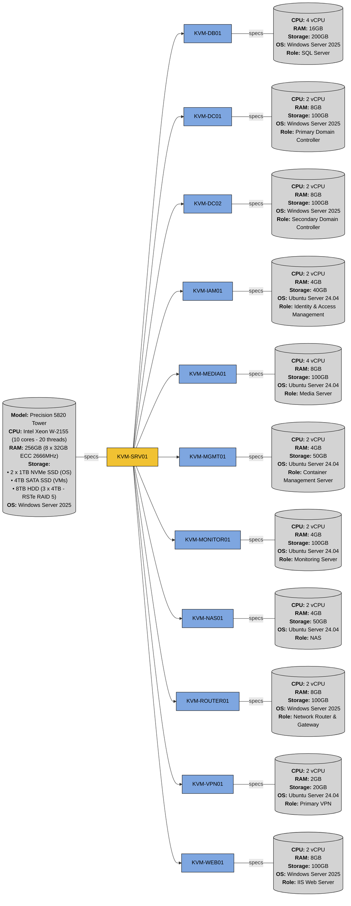

# Infrastructure as Code (IaC) Homelab

A **_homelab provisioning and configuration automation_** solution powered by **_Terraform_** and **_Ansible_**, containerized with **_Docker_**. This setup simplifies **_Windows_**, **_Linux_**, and **_standalone ESXi_** management by leveraging **_declarative provisioning_** and **_idempotent configuration_**, streamlining **_Infrastructure as Code_** (**_IaC_**) principles across hypervisors and service nodes.

## Features

- **_Declarative infrastructure provisioning_** using **_Terraform_** across hypervisors and cloud platforms.
- **_Agentless configuration management_** powered by **_Ansible_** over **_SSH_**.
- **_Docker-based controller_** for environment consistency across platforms.
- **_Modular architecture_** leveraging reusable **_Terraform modules_** and **_Ansible roles_** with external variable configuration.

## Architecture & Responsibilities

This repository separates **_Infrastructure as Code (IaC)_** responsibilities into **_two_** dedicated layers:

|              Layer              |     Tool      | Responsibilities                                                                                                                                          |
| :-----------------------------: | :-----------: | :-------------------------------------------------------------------------------------------------------------------------------------------------------- |
| **Infrastructure Provisioning** | **Terraform** | Declarative management of **_Cloudflare Zero Trust_** resources, including **_access policies_**, **_Cloudflared tunnels_**, and **_DNS CNAME records_**. |
|  **Configuration Management**   |  **Ansible**  | Agentless **_post-provisioning state_** enforcement, **_package management_**, and **_service configuration_**                                            |

## Infrastructure Overview

```mermaid
flowchart LR
  %% 1. KVM-SRV01
  %% - Host
  SRV01_SPECS[("`**Model:** Precision 5820 Tower
                **CPU:** Intel Xeon W-2155 (10 cores - 20 threads)
                **RAM:** 256GB (8 x 32GB ECC 2666MHz)
                **Storage:**
                • 2 x 1TB NVMe SSD (OS)
                • 4TB SATA SSD (VMs)
                • 8TB HDD (3 x 4TB - RSTe RAID 5)
                **OS:** Windows Server 2025`")] -- specs --- SRV01[KVM-SRV01]

  %% - VMs
  SRV01 --> DB01[KVM-DB01] -- specs --- DB01_SPECS[("`**CPU:** 4 vCPU
                                                      **RAM:** 16GB
                                                      **Storage:** 200GB
                                                      **OS:** Windows Server 2025
                                                      **Role:** SQL Server`")]
  SRV01 --> DC01[KVM-DC01] -- specs --- DC01_SPECS[("`**CPU:** 2 vCPU
                                                      **RAM:** 8GB
                                                      **Storage:** 100GB
                                                      **OS:** Windows Server 2025
                                                      **Role:** Primary Domain Controller`")]
  SRV01 --> DC02[KVM-DC02] -- specs --- DC02_SPECS[("`**CPU:** 2 vCPU
                                                      **RAM:** 8GB
                                                      **Storage:** 100GB
                                                      **OS:** Windows Server 2025
                                                      **Role:** Secondary Domain Controller`")]
  SRV01 --> IAM01[KVM-IAM01] -- specs --- IAM01_SPECS[("`**CPU:** 2 vCPU
                                                        **RAM:** 4GB
                                                        **Storage:** 40GB
                                                        **OS:** Ubuntu Server 24.04
                                                        **Role:** Identity & Access Management`")]
  SRV01 --> MEDIA01[KVM-MEDIA01] -- specs --- MEDIA01_SPECS[("`**CPU:** 4 vCPU
                                                            **RAM:** 8GB
                                                            **Storage:** 100GB
                                                            **OS:** Ubuntu Server 24.04
                                                            **Role:** Media Server`")]
  SRV01 --> MGMT01[KVM-MGMT01] -- specs --- MGMT01_SPECS[("`**CPU:** 2 vCPU
                                                            **RAM:** 4GB
                                                            **Storage:** 50GB
                                                            **OS:** Ubuntu Server 24.04
                                                            **Role:** Container Management Server`")]
  SRV01 --> MONITOR01[KVM-MONITOR01] -- specs --- MONITOR01_SPECS[("`**CPU:** 2 vCPU
                                                                    **RAM:** 4GB
                                                                    **Storage:** 100GB
                                                                    **OS:** Ubuntu Server 24.04
                                                                    **Role:** Monitoring Server`")]
  SRV01 --> NAS01[KVM-NAS01] -- specs --- NAS01_SPECS[("`**CPU:** 2 vCPU
                                                        **RAM:** 4GB
                                                        **Storage:** 50GB
                                                        **OS:** Ubuntu Server 24.04
                                                        **Role:** NAS`")]
  SRV01 --> ROUTER01[KVM-ROUTER01] -- specs --- ROUTER01_SPECS[("`**CPU:** 2 vCPU
                                                                  **RAM:** 8GB
                                                                  **Storage:** 100GB
                                                                  **OS:** Windows Server 2025
                                                                  **Role:** Network Router & Gateway`")]
  SRV01 --> VPN01[KVM-VPN01] -- specs --- VPN01_SPECS[("`**CPU:** 2 vCPU
                                                        **RAM:** 2GB
                                                        **Storage:** 20GB
                                                        **OS:** Ubuntu Server 24.04
                                                        **Role:** Primary VPN`")]
  SRV01 --> WEB01[KVM-WEB01] -- specs --- WEB01_SPECS[("`**CPU:** 2 vCPU
                                                        **RAM:** 8GB
                                                        **Storage:** 100GB
                                                        **OS:** Windows Server 2025
                                                        **Role:** IIS Web Server`")]


  %% Styling
  class SRV01 hosts
  classDef hosts fill:#f1c232,stroke:#000,color:#000
  class DB01,DC01,DC02,IAM01,MEDIA01,MGMT01,MONITOR01,NAS01,ROUTER01,VPN01,VPN02,WEB01 vms
  classDef vms fill:#7ea6e0,stroke:#000,color:#000
  class SRV01_SPECS,DB01_SPECS,DC01_SPECS,DC02_SPECS,IAM01_SPECS,MEDIA01_SPECS,MGMT01_SPECS,MONITOR01_SPECS,NAS01_SPECS,ROUTER01_SPECS,VPN01_SPECS,VPN02_SPECS,WEB01_SPECS,WRK01_SPECS,WRK02_SPECS,WRK03_SPECS,WRK04_SPECS specs
  classDef specs fill:#d3d3d3,stroke:#000,color:#000
```

## Documentation

- [Ansible Guide & Role Reference](docs/ANSIBLE.md)
- [Terraform Modules & Deployment](docs/TERRAFORM.md)