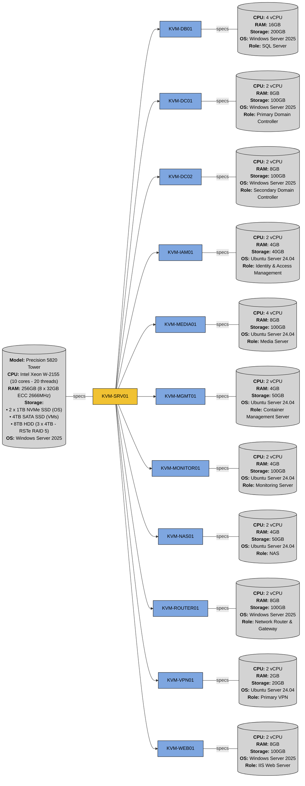

# Homelab Configuration Automation with Ansible

A **_homelab configuration automation_** solution powered by **_Ansible_**, containerized with **_Docker_**. This setup simplifies **_Windows_** and **_standalone ESXi_** systems management by leveraging Ansible's **_idempotent_** and **_declarative configuration_** approach, streamlining **_Infrastructure as Code_** (**_IaC_**) principles for **_Windows_** and **_VMware_** environments.

## Features

- **_Agentless_** architecture powered by **_Ansible_**, utilizing **_SSH_**.
- **_Docker-based controller_** for environment consistency across platforms.
- **_Modular role-based_** configuration and **_tag-based_** execution for targeted provisioning.
- **_Centralized variable management_** using external YAML files.

## Infrastructure Overview


```mermaid
flowchart LR
  %% 1. KVM-SRV01
  %% - Host
  SRV01_SPECS[("`**Model:** Precision 5820 Tower
                **CPU:** Intel Xeon W-2155 (10 cores - 20 threads)
                **RAM:** 256GB (8 x 32GB ECC 2666MHz)
                **Storage:**
                • 2 x 1TB NVMe SSD (OS)
                • 4TB SATA SSD (VMs)
                • 8TB HDD (3 x 4TB - RSTe RAID 5)
                **OS:** Windows Server 2025`")] -- specs --- SRV01[KVM-SRV01]

  %% - VMs
  SRV01 --> DB01[KVM-DB01] -- specs --- DB01_SPECS[("`**CPU:** 4 vCPU
                                                      **RAM:** 16GB
                                                      **Storage:** 200GB
                                                      **OS:** Windows Server 2025
                                                      **Role:** SQL Server`")]
  SRV01 --> DC01[KVM-DC01] -- specs --- DC01_SPECS[("`**CPU:** 2 vCPU
                                                      **RAM:** 8GB
                                                      **Storage:** 100GB
                                                      **OS:** Windows Server 2025
                                                      **Role:** Primary Domain Controller`")]
  SRV01 --> DC02[KVM-DC02] -- specs --- DC02_SPECS[("`**CPU:** 2 vCPU
                                                      **RAM:** 8GB
                                                      **Storage:** 100GB
                                                      **OS:** Windows Server 2025
                                                      **Role:** Secondary Domain Controller`")]
  SRV01 --> IAM01[KVM-IAM01] -- specs --- IAM01_SPECS[("`**CPU:** 2 vCPU
                                                        **RAM:** 4GB
                                                        **Storage:** 40GB
                                                        **OS:** Ubuntu Server 24.04
                                                        **Role:** Identity & Access Management`")]
  SRV01 --> MEDIA01[KVM-MEDIA01] -- specs --- MEDIA01_SPECS[("`**CPU:** 4 vCPU
                                                            **RAM:** 8GB
                                                            **Storage:** 100GB
                                                            **OS:** Ubuntu Server 24.04
                                                            **Role:** Media Server`")]
  SRV01 --> MGMT01[KVM-MGMT01] -- specs --- MGMT01_SPECS[("`**CPU:** 2 vCPU
                                                            **RAM:** 4GB
                                                            **Storage:** 50GB
                                                            **OS:** Ubuntu Server 24.04
                                                            **Role:** Container Management Server`")]
  SRV01 --> MONITOR01[KVM-MONITOR01] -- specs --- MONITOR01_SPECS[("`**CPU:** 2 vCPU
                                                                    **RAM:** 4GB
                                                                    **Storage:** 100GB
                                                                    **OS:** Ubuntu Server 24.04
                                                                    **Role:** Monitoring Server`")]
  SRV01 --> NAS01[KVM-NAS01] -- specs --- NAS01_SPECS[("`**CPU:** 2 vCPU
                                                        **RAM:** 4GB
                                                        **Storage:** 50GB
                                                        **OS:** Ubuntu Server 24.04
                                                        **Role:** NAS`")]
  SRV01 --> ROUTER01[KVM-ROUTER01] -- specs --- ROUTER01_SPECS[("`**CPU:** 2 vCPU
                                                                  **RAM:** 8GB
                                                                  **Storage:** 100GB
                                                                  **OS:** Windows Server 2025
                                                                  **Role:** Network Router & Gateway`")]
  SRV01 --> VPN01[KVM-VPN01] -- specs --- VPN01_SPECS[("`**CPU:** 2 vCPU
                                                        **RAM:** 2GB
                                                        **Storage:** 20GB
                                                        **OS:** Ubuntu Server 24.04
                                                        **Role:** Primary VPN`")]
  SRV01 --> WEB01[KVM-WEB01] -- specs --- WEB01_SPECS[("`**CPU:** 2 vCPU
                                                        **RAM:** 8GB
                                                        **Storage:** 100GB
                                                        **OS:** Windows Server 2025
                                                        **Role:** IIS Web Server`")]


  %% Styling
  class SRV01 hosts
  classDef hosts fill:#f1c232,stroke:#000,color:#000
  class DB01,DC01,DC02,IAM01,MEDIA01,MGMT01,MONITOR01,NAS01,ROUTER01,VPN01,VPN02,WEB01 vms
  classDef vms fill:#7ea6e0,stroke:#000,color:#000
  class SRV01_SPECS,DB01_SPECS,DC01_SPECS,DC02_SPECS,IAM01_SPECS,MEDIA01_SPECS,MGMT01_SPECS,MONITOR01_SPECS,NAS01_SPECS,ROUTER01_SPECS,VPN01_SPECS,VPN02_SPECS,WEB01_SPECS,WRK01_SPECS,WRK02_SPECS,WRK03_SPECS,WRK04_SPECS specs
  classDef specs fill:#d3d3d3,stroke:#000,color:#000
```

## Roles

### General

|                                                                  Role                                                                  | Description                                                                  |
| :------------------------------------------------------------------------------------------------------------------------------------: | :--------------------------------------------------------------------------- |
|         [`firewall_configuration`](ansible-scripts/homelab-ansible-config/roles/general/firewall_configuration/tasks/main.yml)         | Configure **_firewall rules_**                                               |
|   [`linux_hostname_configuration`](ansible-scripts/homelab-ansible-config/roles/general/linux_hostname_configuration/tasks/main.yml)   | Set **_hostname_** of Linux hosts                                            |
|        [`linux_ntp_configuration`](ansible-scripts/homelab-ansible-config/roles/general/linux_ntp_configuration/tasks/main.yml)        | Configure **_NTP settings_** for time synchronization on **_Linux hosts_**   |
|            [`linux_updates`](ansible-scripts/homelab-ansible-config/roles/general/local_user_configuration/tasks/main.yml)             | Perform **_Linux package updates_**                                          |
|       [`local_user_configuration`](ansible-scripts/homelab-ansible-config/roles/general/local_user_configuration/tasks/main.yml)       | Manage **_local user accounts_** and **_passwords_**                         |
|           [`region_configuration`](ansible-scripts/homelab-ansible-config/roles/general/region_configuration/tasks/main.yml)           | Set **_regional_** and **_locale settings_**                                 |
|           [`system_configuration`](ansible-scripts/homelab-ansible-config/roles/general/system_configuration/tasks/main.yml)           | Apply **_system-wide settings_**                                             |
|             [`system_information`](ansible-scripts/homelab-ansible-config/roles/general/system_information/tasks/main.yml)             | Gather **_host information_**                                                |
| [`windows_hostname_configuration`](ansible-scripts/homelab-ansible-config/roles/general/windows_hostname_configuration/tasks/main.yml) | Set **_hostname_** of Windows hosts                                          |
|      [`windows_ntp_configuration`](ansible-scripts/homelab-ansible-config/roles/general/windows_ntp_configuration/tasks/main.yml)      | Configure **_NTP settings_** for time synchronization on **_Windows hosts_** |
|                [`windows_updates`](ansible-scripts/homelab-ansible-config/roles/general/windows_updates/tasks/main.yml)                | Perform **_Windows updates_**                                                |

### Domain

|                                                            Role                                                             | Description                                                             |
| :-------------------------------------------------------------------------------------------------------------------------: | :---------------------------------------------------------------------- |
|           [`domain_creation`](ansible-scripts/homelab-ansible-config/roles/domain/domain_creation/tasks/main.yml)           | Create a new **_AD forest_** along with its **_domains_** and **_OUs_** |
| [`domain_user_configuration`](ansible-scripts/homelab-ansible-config/roles/domain/domain_user_configuration/tasks/main.yml) | Manage **_domain user accounts_** and **_passwords_**                   |
|         [`linux_domain_join`](ansible-scripts/homelab-ansible-config/roles/domain/linux_domain_join/tasks/main.yml)         | **_Join Linux hosts_** to the **_domain_**                              |
|       [`windows_domain_join`](ansible-scripts/homelab-ansible-config/roles/domain/windows_domain_join/tasks/main.yml)       | **_Join Windows hosts_** to the **_domain_**                            |

### Hypervisors

|                                                           Role                                                           | Description                                                |
| :----------------------------------------------------------------------------------------------------------------------: | :--------------------------------------------------------- |
|    [`esxi_vm_deployment`](ansible-scripts/homelab-ansible-config/roles/hypervisors/esxi_vm_deployment/tasks/main.yml)    | Deploy **_VMs_** on **_ESXi host_**                        |
| [`hyper-v_configuration`](ansible-scripts/homelab-ansible-config/roles/hypervisors/hyper-v_configuration/tasks/main.yml) | Install **_Hyper-V_** and configure **_virtual switches_** |
| [`hyper-v_vm_deployment`](ansible-scripts/homelab-ansible-config/roles/hypervisors/hyper-v_vm_deployment/tasks/main.yml) | Deploy **_VMs_** on **_Hyper-V host_**                     |

### Services

|                                                               Role                                                                | Description                                                                                                                               |
| :-------------------------------------------------------------------------------------------------------------------------------: | :---------------------------------------------------------------------------------------------------------------------------------------- |
|        [`authentik_deployment`](ansible-scripts/homelab-ansible-config/roles/services/authentik_deployment/tasks/main.yml)        | Configure **_Authentik_** as a **_centralized identity provider_** and **_SSO gateway_** for **_authentication_** and **_authorization_** |
|        [`docker_configuration`](ansible-scripts/homelab-ansible-config/roles/services/docker_configuration/tasks/main.yml)        | Configure **_Docker_** settings                                                                                                           |
|      [`filebrowser_deployment`](ansible-scripts/homelab-ansible-config/roles/services/filebrowser_deployment/tasks/main.yml)      | Configure **_Filebrowser_** as a **_self-hosted file manager_**                                                                           |
|          [`grafana_deployment`](ansible-scripts/homelab-ansible-config/roles/services/grafana_deployment/tasks/main.yml)          | Configure **_Grafana_** as a **_analytics platform_** for **_dashboards_** and **_data virtualization_**                                  |
|   [`home_assistant_deployment`](ansible-scripts/homelab-ansible-config/roles/services/home_assistant_deployment/tasks/main.yml)   | Configure **_Home Assistant_** as a **_centralized home automation platform_** for **_smart device integration_**                         |
|         [`homepage_deployment`](ansible-scripts/homelab-ansible-config/roles/services/homepage_deployment/tasks/main.yml)         | Configure **_Homepage_** as a **_centralized service dashboard_** for **_infrastructure monitoring_** and **_service discovery_**         |
|              [`iis_deployment`](ansible-scripts/homelab-ansible-config/roles/services/iis_deployment/tasks/main.yml)              | Install and configure **_Internet Information Services_** (**_IIS_**)                                                                     |
|           [`immich_deployment`](ansible-scripts/homelab-ansible-config/roles/services/immich_deployment/tasks/main.yml)           | Configure **_Immich_** as a **_self-hosted photo_** and **_video management solution_** for **_media backup_**                            |
|         [`jellyfin_deployment`](ansible-scripts/homelab-ansible-config/roles/services/jellyfin_deployment/tasks/main.yml)         | Configure **_Jellyfin_** as a **_self-hosted media server_**                                                                              |
|           [`motion_deployment`](ansible-scripts/homelab-ansible-config/roles/services/motion_deployment/tasks/main.yml)           | Configure **_Motion_** as a **_self-hosted security camera system_**                                                                      |
|    [`node_exporter_deployment`](ansible-scripts/homelab-ansible-config/roles/services/node_exporter_deployment/tasks/main.yml)    | Configure **_Node Exporter_** as a **_metrics collector_** for **_Prometheus monitoring_** on **_Linux hosts_**                           |
|              [`npm_deployment`](ansible-scripts/homelab-ansible-config/roles/services/npm_deployment/tasks/main.yml)              | Configure **_Nginx Proxy Manager_** as a **_reverse proxy_** for **_host forwarding_**                                                    |
|        [`portainer_deployment`](ansible-scripts/homelab-ansible-config/roles/services/portainer_deployment/tasks/main.yml)        | Configure **_Portainer_** as a **_container management platform_** for **_Docker environments_**                                          |
|       [`prometheus_deployment`](ansible-scripts/homelab-ansible-config/roles/services/prometheus_deployment/tasks/main.yml)       | Configure **_Prometheus_** as a **_time-series database_** for **_metrics collection_**                                                   |
|    [`snmp_exporter_deployment`](ansible-scripts/homelab-ansible-config/roles/services/snmp_exporter_deployment/tasks/main.yml)    | Configure **_SNMP Exporter_** as a **_metrics collector_** from **_network devices_** and **_ESXi host_** via **_SNMP_**                  |
|        [`tailscale_deployment`](ansible-scripts/homelab-ansible-config/roles/services/tailscale_deployment/tasks/main.yml)        | Configure **_Tailscale_** as a **_mesh VPN service_** for **_secure remote access_**                                                      |
| [`windows_exporter_deployment`](ansible-scripts/homelab-ansible-config/roles/services/windows_exporter_deployment/tasks/main.yml) | Configure **_Windows Exporter_** as a **_metrics collector_** for **_Prometheus monitoring_** on **_Windows hosts_**                      |

## Prerequisites

1.  **_[OpenSSH Server](https://github.com/PowerShell/Win32-OpenSSH/releases/latest)_** installed on the **_targeted hosts_**. Alternatively, this can be installed via **_PowerShell_**:

    ```powershell
    Add-WindowsCapability -Online -Name OpenSSH.Server~~~~0.0.1.0
    ```

2.  **_SSH Service_** enabled on the targeted hosts:

    ```powershell
    Start-Service sshd
    Set-Service -Name sshd -StartupType 'Automatic'
    ```

3.  **_SSH_** allowed through the **_firewall_**:

    ```powershell
    New-NetFirewallRule -Name 'OpenSSH-Server-In-TCP' -DisplayName 'OpenSSH Server (sshd)' -Enabled True -Direction Inbound -Protocol TCP -Action Allow -LocalPort 22 -Profile Any
    ```

> [!NOTE]
>
> - The steps above apply strictly to **_Windows_**/**_Windows Server_** targets.
> - **_Linux_** and **_ESXi_** distributions typically include **_pre-installed SSH_** services.

> [!TIP]
> If the automated **_[khangvum/answer-files](https://github.com/khangvum/answer-files)_** are utilized for OS deployment, **_SSH_** is **_already provisioned_** and **_configured_** during the initial installation.

4.  **_SSH connection_** verified **_once_** from the controller to each host:

    ```bash
    ssh administrator@"<IP_ADDRESS>"
    ```

    **_Accept the host key_** on first connection by typing `yes` when prompted.

## Configuration Setup

1. **Update the inventory and variable files:**

- [`inventory.yml`](ansible-scripts/homelab-ansible-config/inventory.template.yml): Defines the **_target hosts_**.
- **Docker variables:**

  |                                                      File                                                       | Description                                                                                                       |
  | :-------------------------------------------------------------------------------------------------------------: | :---------------------------------------------------------------------------------------------------------------- |
  |        [`iam_var.yml`](ansible-scripts/homelab-ansible-config/variables/docker_var/iam_var.template.yml)        | Define **_Authentik settings_** for **_centralized identity provider_** and **_SSO gateway_**                     |
  |      [`media_var.yml`](ansible-scripts/homelab-ansible-config/variables/docker_var/media_var.template.yml)      | Define **_Immich_** and **_Jellyfin settings_** for **_self-hosted media server_**                                |
  | [`management_var.yml`](ansible-scripts/homelab-ansible-config/variables/docker_var/management_var.template.yml) | Define **_Portainer_**, **_Home Assistant_**, and **_Homepage settings_** for **_centralized service dashboard_** |
  | [`monitoring_var.yml`](ansible-scripts/homelab-ansible-config/variables/docker_var/monitoring_var.template.yml) | Define **_Grafana_**, **_Prometheus_**, and **_Node Exporter settings_** for **_monitoring stack_**               |
  |        [`nas_var.yml`](ansible-scripts/homelab-ansible-config/variables/docker_var/nas_var.template.yml)        | Define **_Filebrowser settings_** for **_self-hosted file manager_**                                              |
  |   [`security_var.yml`](ansible-scripts/homelab-ansible-config/variables/docker_var/security_var.template.yml)   | Define **_Motion settings_** for **_self-hosted security camera system_**                                         |
  |        [`vpn_var.yml`](ansible-scripts/homelab-ansible-config/variables/docker_var/vpn_var.template.yml)        | Define **_Tailscale_** and **_Nginx Proxy Manager settings_** for **_Mesh VPN service_**                          |

- **Domain variables:**

  |                                                  File                                                   | Description                            |
  | :-----------------------------------------------------------------------------------------------------: | :------------------------------------- |
  | [`domain_var.yml`](ansible-scripts/homelab-ansible-config/variables/domain_var/domain_var.template.yml) | Defines the **_domain configuration_** |
  |   [`user_var.yml`](ansible-scripts/homelab-ansible-config/variables/domain_var/user_var.template.yml)   | Defines all **_domain users_**         |

- **Hypervisor variables:**

  |                                                    File                                                    | Description                                                 |
  | :--------------------------------------------------------------------------------------------------------: | :---------------------------------------------------------- |
  |    [`esxi_vm_var.yml`](ansible-scripts/homelab-ansible-config/variables/hypervisor_var/esxi_vm_var.yml)    | Defines **_ESXi VMs_** and their **_specifications_**       |
  | [`hyper-v_vm_var.yml`](ansible-scripts/homelab-ansible-config/variables/hypervisor_var/hyper-v_vm_var.yml) | Define the **_Hyper-V VMs_** and their **_specifications_** |

- **OS variables:**

  |                                                 File                                                  | Description                              |
  | :---------------------------------------------------------------------------------------------------: | :--------------------------------------- |
  |    [`esxi_var.yml`](ansible-scripts/homelab-ansible-config/variables/os_var/esxi_var.template.yml)    | Defines **_ESXi-specific variables_**    |
  |   [`linux_var.yml`](ansible-scripts/homelab-ansible-config/variables/os_var/linux_var.template.yml)   | Defines **_Linux-specific variables_**   |
  | [`windows_var.yml`](ansible-scripts/homelab-ansible-config/variables/os_var/windows_var.template.yml) | Defines **_Windows-specific variables_** |

2.  **Start the Ansible environment:**

    ```bash
    docker compose up -d
    ```

3.  **Access the running Ansible container:**

    ```bash
    docker exec -it ansible_service /bin/bash
    ```

4.  **Execute the playbook to apply the settings:**

    ```bash
    ansible-playbook site.yml -i inventory.yml
    ```

> [!TIP]
> Use `-t` option to selectively run specific plays:
>
> ```bash
> ansible-playbook site.yml -i inventory.yml -t system_information
> ```

## Ansible Vault Commands

When managing **_sensitive credentials_** or **_variables_** in the homelab configuration, consider using `ansible-vault`.

### 1. Create an Encrypted File

To create a new encrypted file:

```bash
ansible-vault create "<VAULT_FILE_PATH>"
```

### 2. View an Encrypted File

To view the contents of an encrypted file without modifying it:

```bash
ansible-vault view "<VAULT_FILE_PATH>"
```

### 3. Edit an Encrypted File Interactively

To edit an encrypted file directly without manually decrypting, modifying, and re-encrypting it:

```bash
ansible-vault edit "<VAULT_FILE_PATH>"
```

### 4. Encrypt an Existing Plaintext File

To secure an unencrypted file:

```bash
ansible-vault encrypt "<VAULT_FILE_PATH>"
```

### 5. Decrypt an Existing Encrypted File

To permanently return an encrypted file to plaintext:

```bash
ansible-vault decrypt "<VAULT_FILE_PATH>"
```

## Playbook Execution with Ansible Vault

When the inventory or variable files are **_encrypted_**, Ansible requires a **_vault password_** to parse and run them successfully. Execution can be handled using one of the following methods:

### Option 1: Manual Password Prompt

To **_prompt interactively_** for the **_vault password_** at runtime, the `--ask-vault-pass` flag is appended to the execution command:

```bash
ansible-playbook site.yml -i inventory.yml --ask-vault-pass
```

### Option 2: Automated Password File

To **_bypass interactive prompts_** during automated runs or continuous deployment pipelines, a **_local password file_** can be referenced directly:

```bash
ansible-playbook site.yml -i inventory.yml --vault-password-file "<PASSWORD_FILE_PATH>"
```